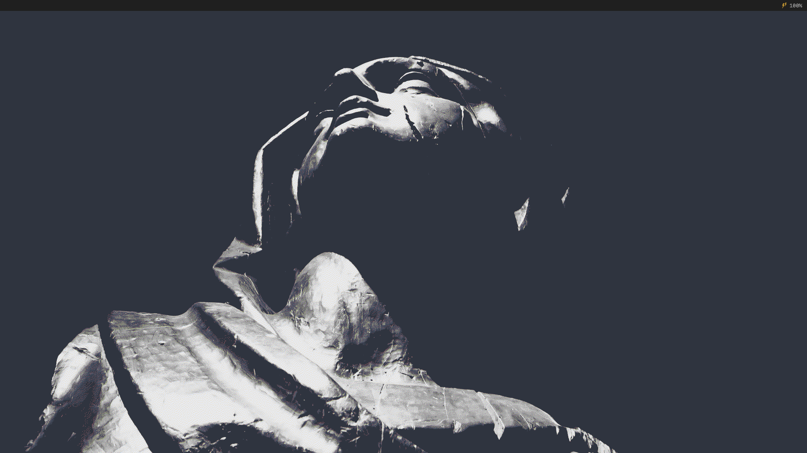
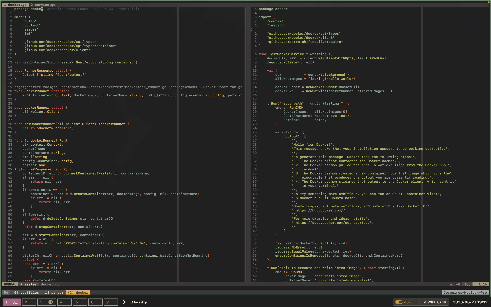
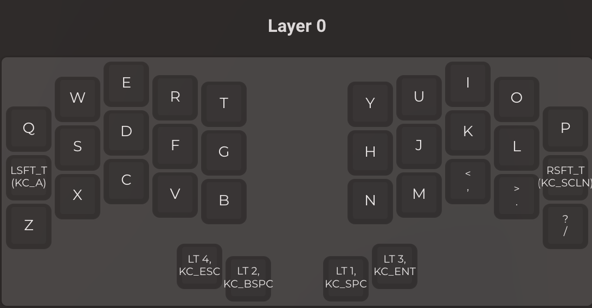
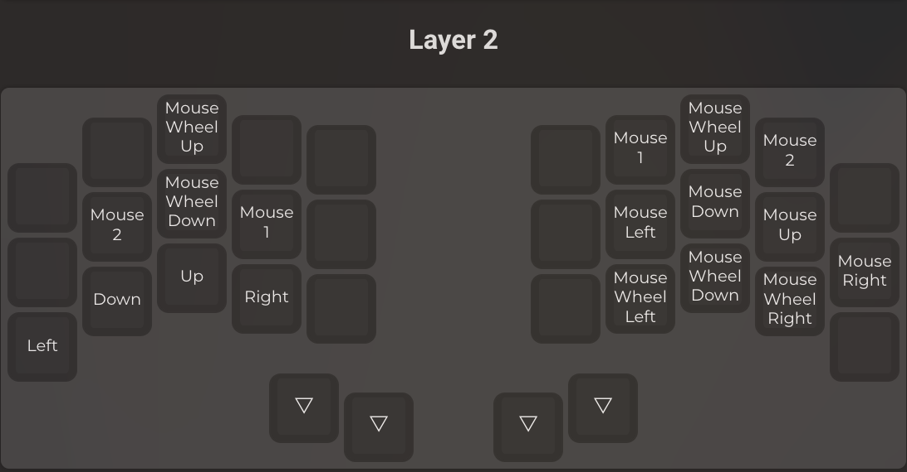
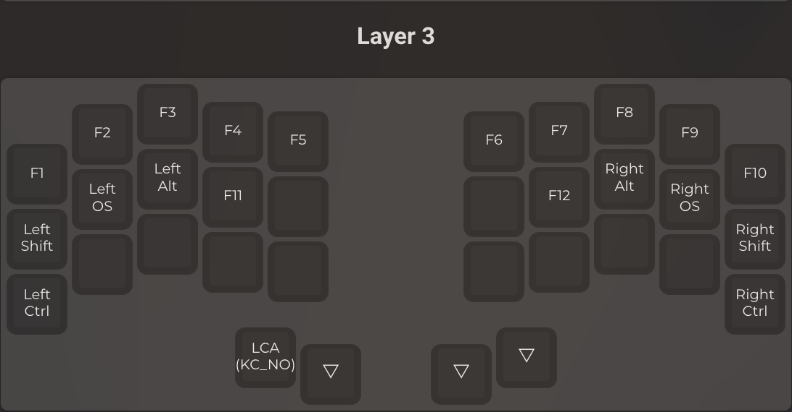
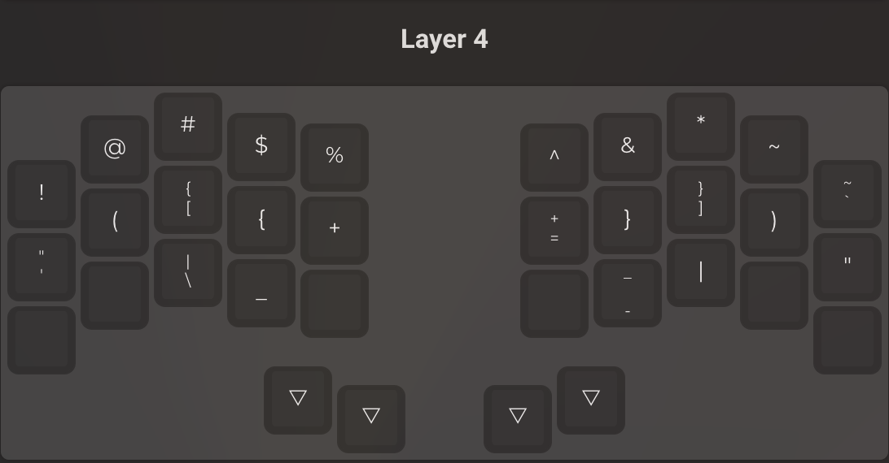

# .dotfiles

This is a quick overview of my dotfiles for MacOS.

# Keyboard layout

## Setup

You can just run `make macsetup`

In case you want to remove the configurations just run `./cleanenv` this will unlink the configs.

## Apps

- Terminal emulator: [Alacritty](https://github.com/alacritty/alacritty)
- Shell: [Zsh](https://ohmyz.sh/)
- Window manager: [Yabai](https://github.com/koekeishiya/yabai)
- Bottom bar: [Sketchybar](https://github.com/FelixKratz/SketchyBar)
- Shortcuts: [Skhd](https://github.com/koekeishiya/skhd)
- Text editor: [Neovim](https://neovim.io/)
- Terminal multiplexer: [Tmux](https://github.com/tmux/tmux)
- Better cat: [Bat](https://github.com/sharkdp/bat)
- Better ls: [Lsd](https://github.com/Peltoche/lsd)
- Git TUI: [Lazygit](https://github.com/jesseduffield/lazygit)
- Symlink manager: [Stow](https://www.gnu.org/software/stow/)

